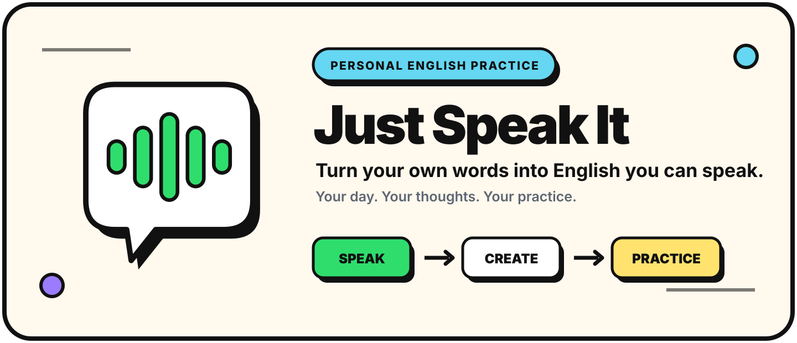
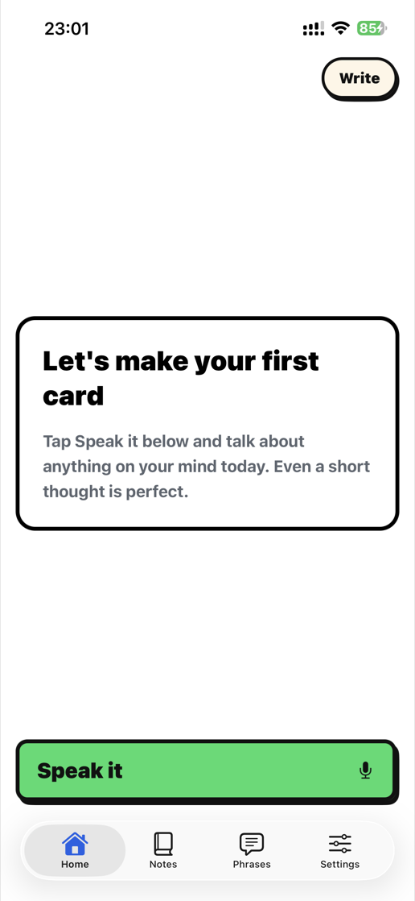
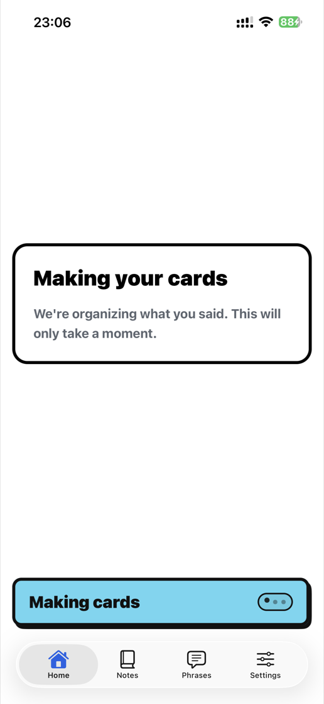
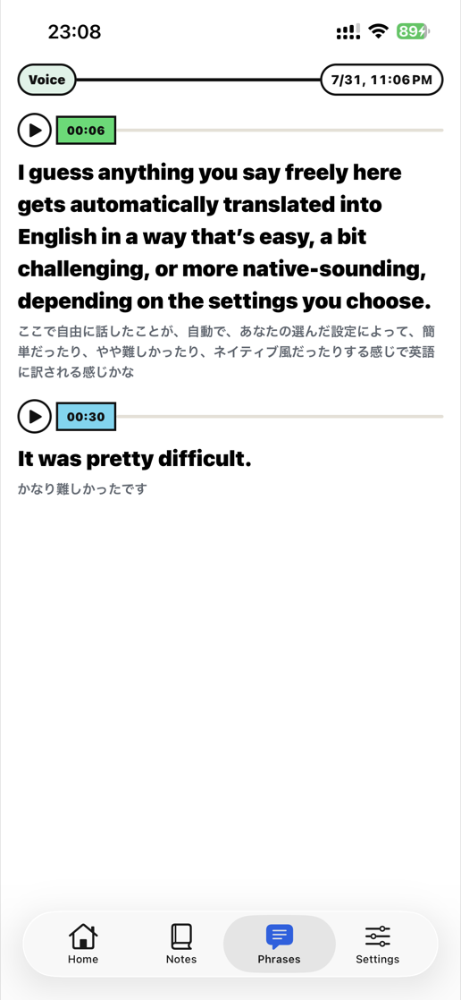
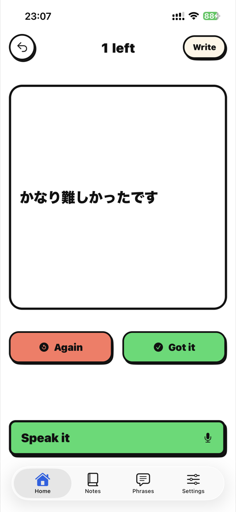
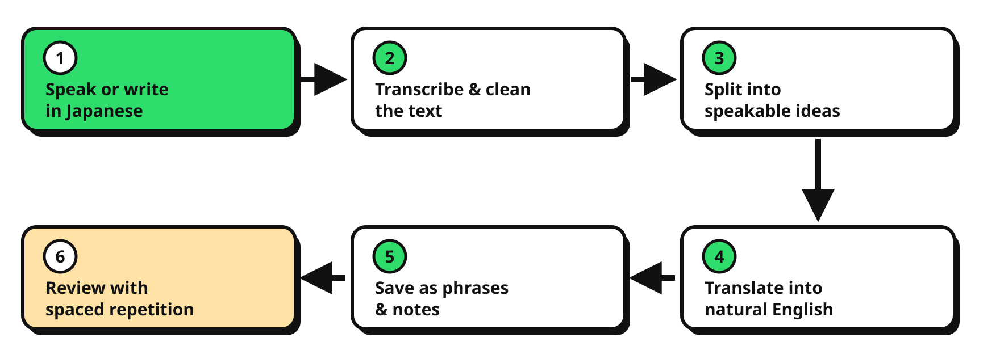
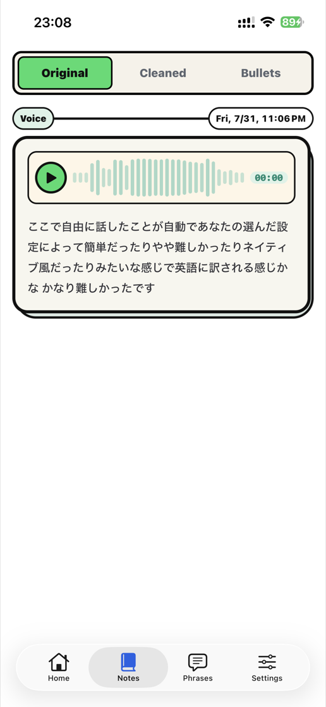
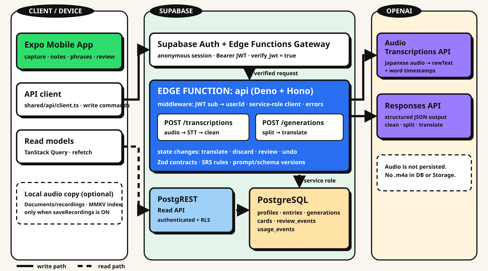

<div align="center">
  

  <br />

  <strong>Speak in Japanese. Turn your own words into English you can practice.</strong>
  <br />
  A mobile app that turns everyday thoughts and journal entries into English speaking practice.

  <br /><br />

  
  
  
  
  
</div>

## Turn your life into English practice

Memorizing textbook sentences does not always help you talk about your own day, thoughts, or feelings. Just Speak It starts with something you want to say in Japanese and turns it into **English that matters to you**—ready to practice again and again.

| 1. Capture | 2. Create | 3. Practice |
| :---: | :---: | :---: |
| Speak or write in Japanese | Clean, split, and translate your thought | Review with `Again` / `Got it` |

<p align="center">
  
  &nbsp;
  
  &nbsp;
  
  &nbsp;
  
</p>

<p align="center"><sub>Speak or write → Generate cards → Save phrases → Review</sub></p>

## From one thought to a practice loop



The app transcribes and cleans your speech, divides it into ideas that are easy to say, and translates them into English. Each card becomes part of a spaced-repetition loop instead of disappearing after a single session.

## What you can do

| | Experience |
| --- | --- |
| **🎙️ Speak / Write** | Start with Japanese speech or text. You do not need to compose the English first. |
| **📖 Notes** | Revisit the original Japanese, cleaned text, and bullet-point summary. If local recording is enabled, you can also replay the audio stored on your device. |
| **💬 Phrases** | Browse the Japanese–English cards created from your own experiences. |
| **🧠 Review** | Look at the Japanese, answer in English, and choose `Again` or `Got it`. Successful reviews return after 3 → 7 → 14 → 30 → 60 days; `Again` brings a card back after 1 day. Review actions support undo and retrying synchronization. |
| **🎛️ Customize** | Choose card length, English style, app language, appearance, and local recording behavior. |

<details>
  <summary><strong>See the Notes screen</strong></summary>
  <br />
  <p align="center">
    
  </p>
</details>

## Engineering behind the experience



- **One write API** — Authentication, Zod validation, and mutations are centralized in a single Supabase Edge Function.
- **Shared contracts** — The mobile app and API use the same request and response schemas.
- **Idempotency** — Retrying a request does not repeat the same AI work or create duplicate cards.
- **Local outbox** — Review and undo actions remain on the device during temporary failures and synchronize later.
- **PostgREST + RLS** — Read access is restricted to the authenticated user's own rows.
- **Audio handling** — Audio is sent to OpenAI for transcription but is not stored in Supabase Database or Storage. Optional replay copies stay on the device.

See the [architecture documentation](docs/architecture/README.md) for the low-level diagram.

## Technology stack

| Layer | Technologies |
| --- | --- |
| Mobile | Expo SDK 57 · React Native 0.86 · Expo Router · Expo Audio · Expo Speech |
| UI / State | React 19 · TanStack Query · React Native MMKV · i18next |
| Backend | Supabase Auth · Edge Functions (Deno + Hono) · PostgreSQL · PostgREST · Row Level Security |
| AI | OpenAI speech-to-text · structured text generation |
| Contracts / Quality | TypeScript 6 · Zod 4 · Vitest · Expo ESLint |

This repository uses npm workspaces. Pure domain logic such as SRS lives in `packages/core`, while schemas shared by the app and API live in `packages/contract`.

## Getting started

### Prerequisites

- Node.js 22.13.x or newer ([minimum for Expo SDK 57](https://docs.expo.dev/versions/v57.0.0/))
- npm
- Supabase CLI
- An Expo development environment for iOS or Android
- A Supabase project and OpenAI API key

### 1. Install

```bash
npm install
```

### 2. Configure the app

Create `.env.local` in the repository root.

```bash
EXPO_PUBLIC_SUPABASE_URL=
EXPO_PUBLIC_SUPABASE_PUBLISHABLE_KEY=
```

Set `OPENAI_API_KEY` for the Supabase Edge Function. You can optionally override the models with `OPENAI_TEXT_MODEL` and `OPENAI_STT_MODEL`.

If you use your own Supabase project, enable anonymous sign-ins in Supabase Auth.

### 3. Create a development build

```bash
npm run ios
# or
npm run android
```

This app contains a custom native module, so development on a device or simulator requires a development build. After the first build, start Metro normally.

```bash
npm run start
```

### Static checks

```bash
npm run lint
npm run typecheck
npm test
```

## Database & API

App inserts, updates, and deletes go through the `api` Edge Function. Regular client access is primarily limited to reads.

| Table | Responsibility |
| --- | --- |
| `entries` | Original text, cleaned text, bullet summary, word timestamps, and waveform |
| `generations` | Split / translate state, recovery, idempotency, and discard behavior |
| `cards` | Japanese–English cards and derived SRS state |
| `review_events` | Append-only review history and undo |
| `usage_events` | AI usage records and rate-limit accounting |

While the project remains in development at `1.0.0`, database migrations favor a simple, clean schema over backward compatibility and may rebuild existing tables destructively.

```bash
# Apply the schema to the hosted Supabase project, then regenerate types
supabase db push --yes
npm run db:types

# Deploy the Edge Function
npm run functions:deploy
```

- [OpenAPI specification](docs/api-openapi.md)
- [Postman collection guide](docs/postman/README.md)
- [Low-level architecture](docs/architecture/README.md)
